# Домашнее задание 1. Создание и нормализация базы данных

### Исходная таблица с данными:
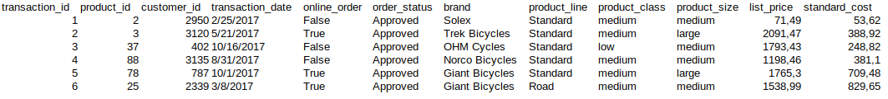
### Нормализованная структура базы данных:
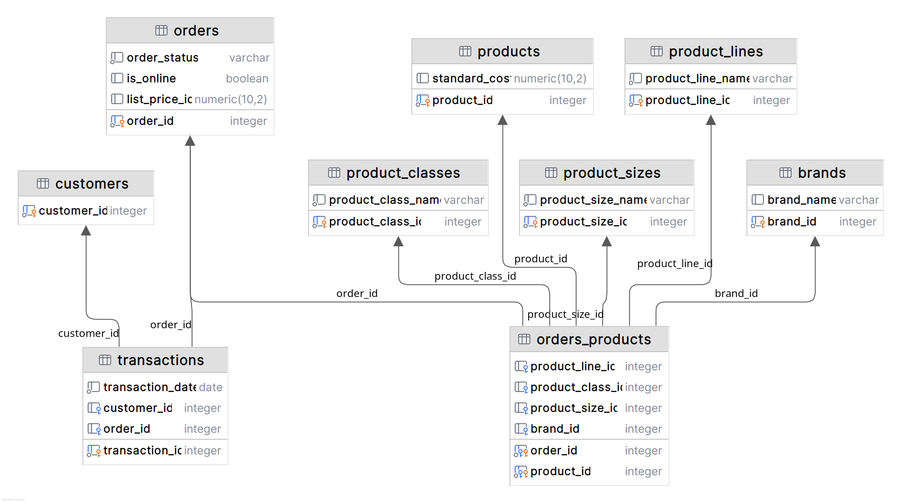

Таблицы **transactions, orders, product_sizes, brands, products, product_lines, product_classes** находятся в 3НФ, т.к неключевые атрибуты данных таблиц не находятся в транзитивной зависимости.
Изначально:
-  информация по заказу (**online_order, order_status**) находится в функциональной зависимости от ключа *transaction_id* (2НФ). Создаем отдельную таблицу для сущности order и выносим туда все атрибуты связанные с заказом.  
-  по исходной таблице товары могу участвовать в разных транзакциях. При этом информацию по товару также зависит от ключа *transaction_id*. Создаем отдельную таблицу products, где атрибуты товара будут зависеть только от самого товара (3НФ). Связь между сущностями transaction и product сделаем через order, позволяя в рамках заказа добавлять несколько продуктов (хотя из таблицы в 1 заказе всегда один товар). Выполняем это с помощью соединительной таблицы **orders_products**
-  с таблицами **product_sizes, brands, product_lines, product_classes** ситуция одинаковая, атрибуты в исходной таблице зависят от transaction_id. Продукт может иметь различные "модификации" этих параметров 3НФ. Поэтому логично, что таблица orders_products будет содержать эти параметры.

### DDL scripts(for dialect PostgreSQL):
```sql
CREATE TABLE IF NOT EXISTS "customers"
(
    "customer_id" serial PRIMARY KEY
);

CREATE TABLE IF NOT EXISTS "orders"
(
    "order_id"      serial PRIMARY KEY,
    "order_status"  varchar NOT NULL,
    "is_online"     boolean,
    "list_price_id" decimal(10, 2) not null
);

CREATE TABLE IF NOT EXISTS "brands"
(
    "brand_id"   serial PRIMARY KEY,
    "brand_name" varchar not null
);

CREATE TABLE IF NOT EXISTS "product_lines"
(
    "product_line_id"   serial PRIMARY KEY,
    "product_line_name" varchar not null
);

CREATE TABLE IF NOT EXISTS "product_classes"
(
    "product_class_id"   serial PRIMARY KEY,
    "product_class_name" varchar not null
);

CREATE TABLE IF NOT EXISTS "product_sizes"
(
    "product_size_id"   serial PRIMARY KEY,
    "product_size_name" varchar not null
);

CREATE SEQUENCE IF NOT EXISTS product_id_seq START WITH 0 MINVALUE 0 MAXVALUE 999999999999999;

CREATE TABLE IF NOT EXISTS "products"
(
    "product_id"    integer PRIMARY KEY DEFAULT nextval('product_id_seq'),
    "standard_cost" decimal(10, 2) not null
);

ALTER SEQUENCE product_id_seq OWNED BY products.product_id;

CREATE TABLE IF NOT EXISTS "transactions"
(
    "transaction_id"   serial PRIMARY KEY,
    "transaction_date" date NOT NULL,
    "customer_id"      integer NOT NULL REFERENCES customers ("customer_id"),
    "order_id"         integer NOT NULL REFERENCES orders ("order_id")
);

CREATE TABLE IF NOT EXISTS "orders_products"
(
    "order_id"         integer REFERENCES orders ("order_id"),
    "product_id"       integer REFERENCES products ("product_id"),
    "product_line_id"  integer REFERENCES product_lines ("product_line_id"),
    "product_class_id" integer REFERENCES product_classes ("product_class_id"),
    "product_size_id"  integer REFERENCES product_sizes ("product_size_id"),
    "brand_id"         integer REFERENCES brands ("brand_id"),
    PRIMARY KEY ("order_id", "product_id")
);

```

### DML scripts(for dialect PostgreSQL):
```SQL
INSERT INTO customers(customer_id)
VALUES (1),
       (2);

INSERT INTO product_classes (product_class_id, product_class_name)
VALUES (1, 'medium'),
       (2, 'high'),
       (3, 'low');

INSERT INTO product_sizes(product_size_id, product_size_name)
VALUES (1, 'small'),
       (2, 'medium'),
       (3, 'large');

INSERT INTO product_lines(product_line_id, product_line_name)
VALUES (1, 'Standard'),
       (2, 'Road'),
       (3, 'Touring');

INSERT INTO brands(brand_id, brand_name)
VALUES (1, 'Giant Bicycles'),
       (2, 'OHM Cycles'),
       (3, 'Norco Bicycles'),
       (4, 'Solex');

INSERT INTO products(product_id, standard_cost)
VALUES (0, 131.92),
       (1, 297.43);

INSERT INTO orders(order_id, is_online, order_status)
VALUES (1, true, 'Approved'),
       (2, null, 'Cancelled');

INSERT INTO orders_products(order_id, product_id, product_line_id, product_class_id, product_size_id, brand_id)
VALUES (1, 1, 1, 1, 1, 1),
       (2, 0, null, null, null, null);

INSERT INTO transactions (transaction_id, transaction_date, customer_id, order_id)
VALUES (1, '12/21/2017', 1, 1),
       (2, '1/19/2017', 2, 2);
```


**Результаты выполнения ddl-скриптов:**

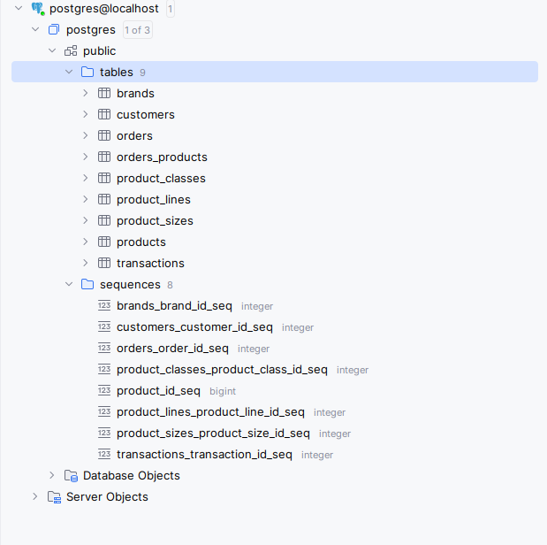


**Результаты выполнения dml-скриптов:**

Table **transactions**:
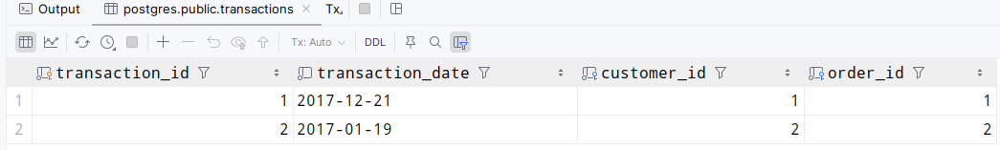

Table **orders**:

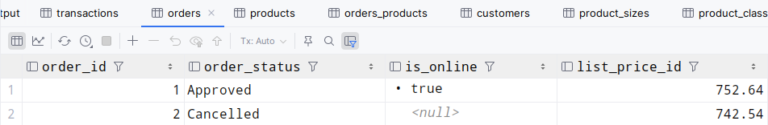

Table **products**:

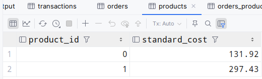

Table **product_lines**:

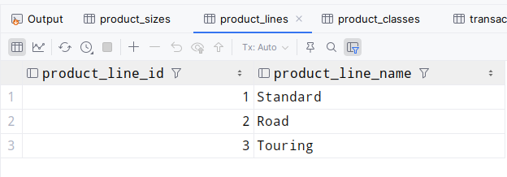

Table **product_sizes**:

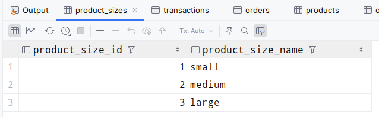

Table **product_classes**:

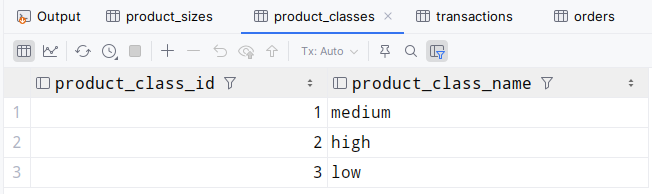

Table **brands**:

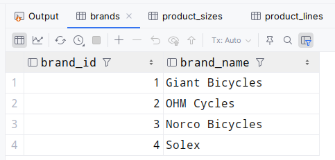

Table **orders_products**:

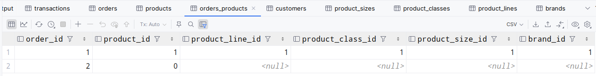

Table **customers**:

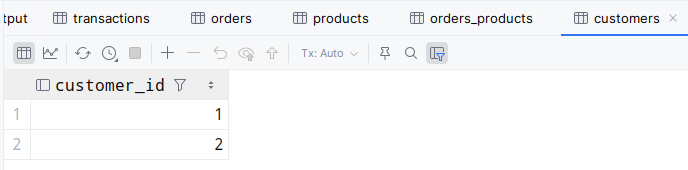